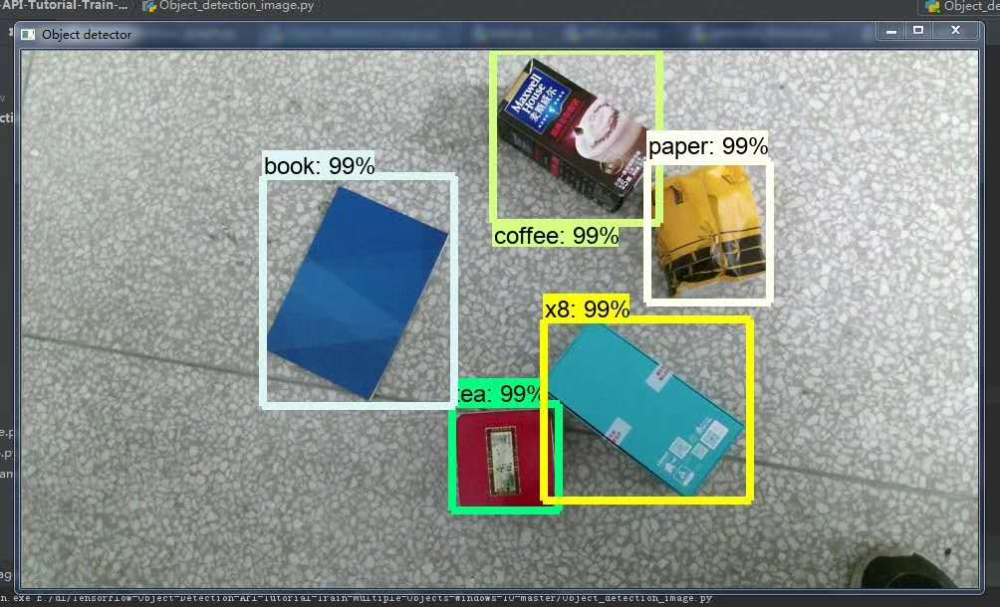

## according to Repository :  
https://github.com/EdjeElectronics/TensorFlow-Object-Detection-API-Tutorial-Train-Multiple-Objects-Windows-10

### trianing
according Train.md trianing my images (https://pan.baidu.com/s/1eks_GgvU_Umj5ff52Jhojg password：kwed).finally, get reslut(链接：https://pan.baidu.com/s/1qcHgMlTsJGUK6pNbCnd39Q password：69cg) 
### run：  

